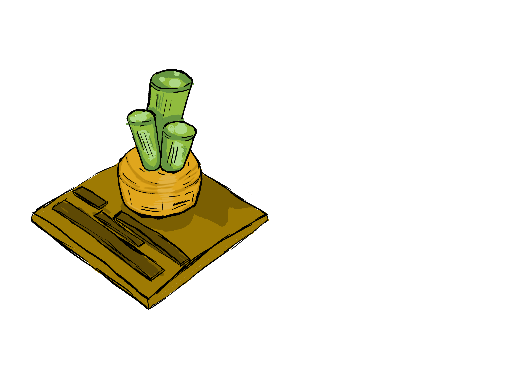

# *Potions & Pets*: A Magical Meal

## Summery

Potions and Pets is a cosy VR game that will combine the essences of most cosy games with michanics similar to the cooking mama franchise.

## Game play     

Farm, cook and brew your way into your favorite animal sanctuary. Farm for ingreadeants to make amazing meals to impress npcs to get special potion ingreadeants to summon you new pets/best freinds.

While cultivating your garden chop, dig, and fight pests to gain better ingreadeants for food and potions. the better the quality of ingreadents the more mythical ingreadents you will obtain to make better potions. When you obtain a mythical pet from a potion there is a chance that they will bring a Legendary Peach Pit with them in the summonig. plant this seed to start a special quest to get a new neighbor in the mountins!

## Your neighbors: _They're a friendly sort_

**Mr.Frog** 
:Your semi aquatic neighbor by the pond he loves to buy and sell items of no value that can help you gain better yeilds in your crops ~~how does that broken hose make the tomatos grow faster~~ 

**Mrs.Fox** 
:She lives up the clifs in her orchard you can always count on her to get you the fruits you cant grow. *she would love it if you called her grandma fox*

## **Features**:   the sky is the limit

with hand traking softwear you can use any of the mechanics given to you or you can use your bare hands to do everything from grabing the fruit off the vine to diging a hole. The options are endless. This game will only be a demo of what is to come.

